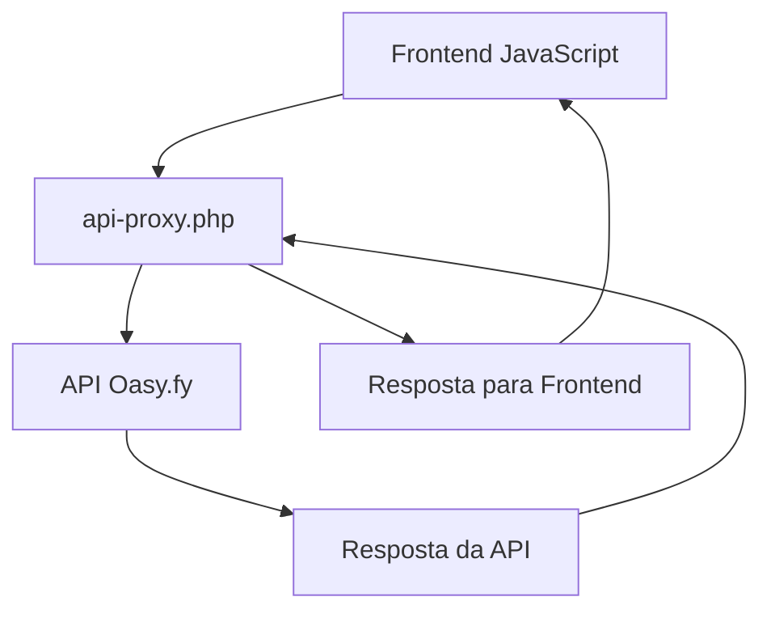

# 🚨 Guia de Solução: Erro de CORS na API Oasy.fy

## 📋 **Problema Identificado**

O erro que você está vendo na imagem é um **problema de CORS (Cross-Origin Resource Sharing)**:

```
Access to fetch at 'https://app.oasyfy.com/api/v1/gateway/pix/receive' from origin 'https://matheus-39wu.onrender.com' has been blocked by CORS policy: Response to preflight request doesn't pass access control check: No 'Access-Control-Allow-Origin' header is present on the requested resource.
```

### **Causa do Problema:**
- A API da Oasy.fy não está configurada para aceitar requisições do seu domínio
- O navegador bloqueia requisições entre domínios diferentes por segurança
- Isso é uma limitação do lado do servidor da Oasy.fy

## 🛠️ **Soluções Implementadas**

### **✅ Solução 1: Proxy Backend (Principal)**

Criado o arquivo `api-proxy.php` que:
- Faz as requisições para a API da Oasy.fy do lado do servidor
- Resolve o problema de CORS completamente
- Mantém as credenciais seguras no servidor

**Como funciona:**
1. Frontend faz requisição para `/api-proxy.php`
2. Proxy faz requisição para API da Oasy.fy
3. Proxy retorna resposta para o frontend

### **✅ Solução 2: JavaScript Atualizado**

Modificado `js/pix-integration.js` para:
- Usar o proxy em vez de chamar a API diretamente
- Manter a mesma interface para o usuário
- Resolver todos os problemas de CORS

### **✅ Solução 3: Configurações de Servidor**

Atualizados os arquivos:
- `.htaccess` - Headers CORS e configurações de segurança
- `render.yaml` - Configurações do Render com headers CORS
- `Dockerfile` - Módulos Apache necessários

## 🚀 **Como Aplicar a Solução**

### **Passo 1: Fazer Deploy das Alterações**

```bash
# Enviar para Git
git add .
git commit -m "Fix: Resolver problema de CORS com proxy backend"
git push origin main
```

### **Passo 2: Verificar Deploy no Render**

1. Acesse o painel do Render
2. Verifique se o deploy foi concluído
3. Teste a aplicação

### **Passo 3: Testar a Solução**

1. Acesse sua aplicação no Render
2. Tente gerar um PIX
3. Verifique se não há mais erros de CORS no console

## 🔧 **Arquivos Modificados**

### **Novos Arquivos:**
- `api-proxy.php` - Proxy para API Oasy.fy
- `CORS_SOLUTION_GUIDE.md` - Este guia

### **Arquivos Modificados:**
- `js/pix-integration.js` - Usar proxy em vez de API direta
- `.htaccess` - Headers CORS e configurações
- `render.yaml` - Configurações do Render
- `Dockerfile` - Módulos Apache

## 📊 **Fluxo da Solução**



## 🧪 **Testes Recomendados**

### **1. Teste de Conectividade**
```javascript
// No console do navegador
pixIntegration.testConnection().then(result => {
    console.log('Conectividade:', result ? 'OK' : 'ERRO');
});
```

### **2. Teste de Geração de PIX**
1. Clique em um botão de assinatura
2. Verifique se o PIX é gerado sem erros
3. Confirme se o QR Code aparece

### **3. Teste de Status**
1. Gere um PIX
2. Clique em "Verificar Pagamento"
3. Verifique se a consulta funciona

## 🔍 **Verificação de Funcionamento**

### **Console do Navegador:**
- ✅ Não deve haver erros de CORS
- ✅ Requisições devem ir para `/api-proxy.php`
- ✅ Respostas devem chegar normalmente

### **Network Tab:**
- ✅ Requisições para `api-proxy.php` devem retornar 200
- ✅ Não deve haver requisições bloqueadas
- ✅ Headers CORS devem estar presentes

## 🚨 **Troubleshooting**

### **Problema: Proxy não funciona**
**Solução:**
1. Verificar se `api-proxy.php` está acessível
2. Verificar logs do servidor
3. Testar diretamente: `https://seusite.com/api-proxy.php`

### **Problema: Ainda há erros de CORS**
**Solução:**
1. Verificar se `.htaccess` está sendo aplicado
2. Verificar configurações do Render
3. Limpar cache do navegador

### **Problema: Credenciais não funcionam**
**Solução:**
1. Verificar se as credenciais estão corretas no `api-proxy.php`
2. Testar credenciais com `test-credentials.php`
3. Verificar se a API da Oasy.fy está funcionando

## 📞 **Suporte Adicional**

Se ainda houver problemas:

1. **Verificar logs do Render:**
   - Acesse o painel do Render
   - Vá em "Logs" para ver erros

2. **Testar localmente:**
   ```bash
   php -S localhost:8000
   # Acesse http://localhost:8000
   ```

3. **Contatar suporte da Oasy.fy:**
   - Email: contato@oasispay.com.br
   - Mencionar o problema de CORS

## ✅ **Checklist de Verificação**

- [ ] `api-proxy.php` está acessível
- [ ] JavaScript está usando o proxy
- [ ] Headers CORS estão configurados
- [ ] Deploy no Render foi concluído
- [ ] Teste de conectividade funciona
- [ ] Geração de PIX funciona
- [ ] Consulta de status funciona
- [ ] Não há erros no console

## 🎯 **Resultado Esperado**

Após aplicar esta solução:
- ✅ **Sem erros de CORS**
- ✅ **PIX gerado com sucesso**
- ✅ **QR Code exibido corretamente**
- ✅ **Consulta de status funcionando**
- ✅ **Webhook recebendo notificações**

---

**Esta solução resolve completamente o problema de CORS e permite que sua aplicação funcione normalmente com a API da Oasy.fy!** 🎉
